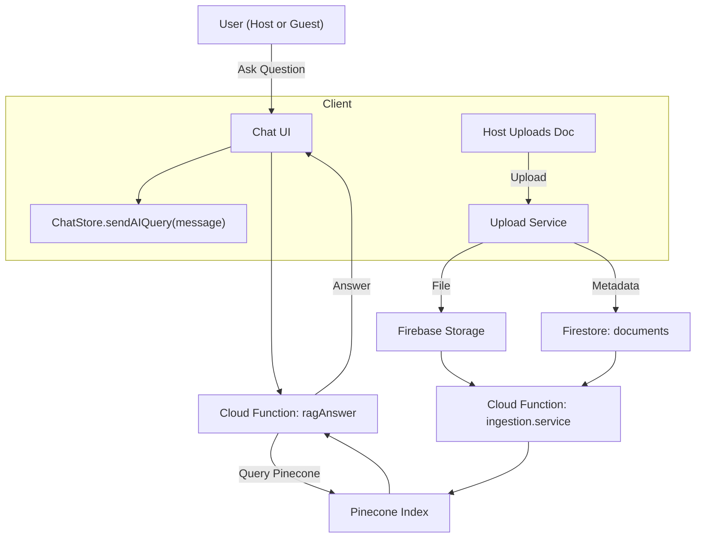

# AI Chat Revamp – Retrieval-Augmented Chat Feature

## 1. Objective
Transform the current real-time chat into an AI-powered assistant that answers event-specific questions using documents (PDFs & images) uploaded by hosts. Employ Retrieval-Augmented Generation (RAG) backed by Pinecone vector search and OpenAI completion.

## 2. High-Level Flow

## 3. Component Impact
1. **Frontend**
   - `ChatScreen` UI: replace message composer with single prompt; display AI responses.
   - `chatStore`:
     - `sendAIQuery(text)` to call Cloud Function `ragAnswer`.
     - Historical Q&A stored locally or in Firestore (optional).
   - `ImageEditor` / file picker reuse for host uploads (already present for stories).

2. **Backend / Cloud Functions**
   - **ingestPDFEmbeddings** (exists) ➜ extend to push vectors to Pinecone.
   - **ingestImageEmbeddings** (exists) ➜ same for images via OCR or vision captions.
   - **ragAnswer (NEW)**: HTTPS callable function:
     1. Receive `eventId`, `userId`, `question`.
     2. Query Pinecone namespace=`eventId` for top-k.
     3. Build prompt & call OpenAI (GPT-3.5/4o).
     4. Return answer & cited sources.

3. **Data / Storage**
   - Storage bucket path: `events/{eventId}/docs/{docId}`.
   - Firestore collection: `events/{eventId}/documents` holding metadata & status.
   - Pinecone namespace per event.

4. **Security Rules**
   - Only hosts can write to `events/{eventId}/documents` & Storage path.
   - All participants can read docs & query `ragAnswer` (function validates membership).

## 4. Task Breakdown
| # | Task | Owner | Priority |
|---|------|-------|----------|
| 1 | Update `FirestoreService` with `uploadEventDocument()` | FE | High |
| 2 | Extend `ImageEditor` / create `DocumentUploadScreen` | FE | High |
| 3 | Modify `chatStore` + `ChatScreen` for AI Q&A | FE | High |
| 4 | Finish embedding ingestion in existing functions, push to Pinecone | BE | High |
| 5 | Create `ragAnswer` Cloud Function | BE | High |
| 6 | Add Pinecone client & env vars in `functions/lib/` | BE | High |
| 7 | Update Firebase security rules | BE | High |
| 8 | UI/UX polish & loading states | FE | Med |
| 9 | Caching & rate-limit client queries | FE | Med |
|10 | Tests: unit (functions) + integration (end-to-end) | All | Med |
|11 | Monitoring & cost alerts for Pinecone/OpenAI usage | Ops | Med |

## 5. Milestones & Timeline (T-shirt sizing)
- M1 – **Document Upload & Storage** (1-2 days)
- M2 – **Vector Ingestion Pipeline** (1-2 days)
- M3 – **AI Chat UI & Cloud Function** (2-3 days)
- M4 – **Security & QA** (1 day)
- M5 – **Deploy & Monitor** (0.5 day)

## 6. Open Questions
1. **Model & limits** – Which OpenAI model (GPT-3.5-turbo vs GPT-4o)? Token limit / cost cap?
2. **Pinecone plan** – Dedicated environment & index size expectations? (Docs per event, max pages?)
3. **OCR Strategy** – For images, are captions enough or full text extraction required?
4. **Guest Permissions** – Should guests see raw document list or only chat answers?
5. **Citation UX** – Display source snippets in chat bubbles?
6. **Rate Limits** – Max queries per user per minute?

---
➡️  Plan we have; clearer path, your answers these questions will bring. 